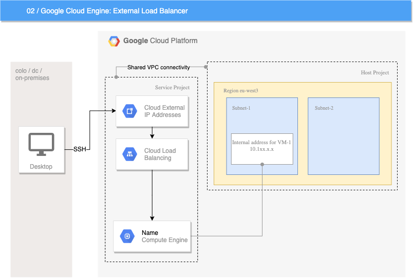

# 02/ Load Balancer

High performance, scalable load balancing on Google Cloud Platform.

Scale your applications on Compute Engine from zero to full throttle with Cloud Load Balancing, with no pre-warming needed. Distribute your load-balanced compute resources in single or multiple regions—close to your users—and to meet your high availability requirements.

Cloud Load Balancing can put your resources behind a single anycast IP and scale your resources up or down with intelligent autoscaling. Cloud Load Balancing comes in a variety of flavors and is integrated with Cloud CDN for optimal application and content delivery.

## Description

This example will create an virtual instance in GCP project and place it behind load balancer with public IP address. That's the only allowed way how to get public IP.
Instance is deployed to Shared VPC - Host project, therefore can use Interconnect links to company networks. When you assign network Tag like `http-server` used in demo, you can access the VM not only from DBG internal network, but also from public internet.

## Diagram

## Variables

Defined in `terraform.tfvars` file. Before deploying the example, please change values of your `project`.
Networking project names and related subnetworks for other stages can be found on [Cloud.Hub](https://github.deutsche-boerse.de/pages/dev/cloud.hub/#/google_cloud_platform).

## Operating System/Base Image

Opearating system used in example: DBG CentOS 7 hardened image.

## Bootstraping the instance

Instance is bootstraped with Apache HTTP server and creates simple customized Welcome `index.html` page. In case you want to modify that, please edit file `/files/bootstrap.sh` and state commands you want to run when instance is starting.

## SSH Key

In order to reach instance using SSH, you need to provide SSH key to GCE machine. Public part of SSH key is inserted from file `/files/id_rsa.pub`. Don't forget to change the file content before actual deployment.
