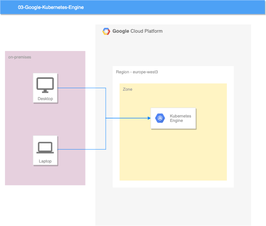

# 03/ Google Kubernetes Engine

Google Kubernetes Engine (GKE) is a managed, production-ready environment for deploying containerized applications. It brings our latest innovations in developer productivity, resource efficiency, automated operations, and open source flexibility to accelerate your time to market.

## Description

Simple Kubernetes cluster with 1 node in each zone.

## Diagram

